# Organigramm

This organizational chart shows the current structure of CodeTechSolutions as of March 2026. Our structure promotes clear accountability and efficient decision-making across all departments.

## Organizational Structure

```mermaid
graph TD
    CEO["Dr. Balázs Kovács<br/>CEO"]
    OPS["Eszter Nagy<br/>Infrastructure Lead"]
    DEV["Kristóf Varga<br/>Dev Lead"]
    SALES_MGR["Réka Vass<br/>Sales Manager"]
    HR["Judit Varga<br/>HR Manager"]
    FIN["Péter Kocsis<br/>Finance Officer"]
    PMO1["Katalin Fodor<br/>Project Manager"]
    PMO2["András Lőrinc<br/>Project Manager"]

    CEO --> OPS
    CEO --> DEV
    CEO --> SALES_MGR
    CEO --> HR
    CEO --> FIN
    CEO --> PMO1
    CEO --> PMO2

    OPS --> ZFARKAS["Zoltán Farkas<br/>Sr. Systems Engineer"]
    OPS --> GTOTH["Gergő Tóth<br/>Systems Operator"]

    GTOTH --> TMOLNAR["Sophie Laurent<br/>Helpdesk"]
    GTOTH --> RSZALAI["Erik Lindberg<br/>Helpdesk"]

    DEV --> AHORVATH["James Mitchell<br/>Backend Developer"]
    DEV --> DSZABO["Sarah Chen<br/>Frontend Developer"]
    DEV --> PMOLNAR["Marco Rossi<br/>Full-stack Developer"]
    DEV --> LKISS["Lili Kiss<br/>QA Engineer"]
    DEV --> MBALOGH["David O'Brien<br/>DevOps Engineer"]
    DEV --> NFEKETE["Elena Petrova<br/>Software Engineer"]
    DEV --> TRACZ["Yuki Tanaka<br/>Mobile Developer"]
    DEV --> ESZEKELY["Eszter Székely<br/>Data Engineer"]
    DEV --> BREVESS["Bence Révész<br/>Cloud Engineer"]
    DEV --> APAPP["Anna Papp<br/>UI/UX Developer"]
    DEV --> GMOLNAR["Carlos Rivera<br/>Integration Engineer"]

    SALES_MGR --> MHORVATH["Oliver Schmidt<br/>Account Executive"]
    SALES_MGR --> DKISS["Raj Patel<br/>Sales Representative"]
```

For detailed information about each department's responsibilities and focus areas, see the [Department Information](./departments.md) page.

## Employee Directory

| Name | Department | Position | Username | Email | Reports To |
|---|---|---|---|---|---|
| Dr. Balázs Kovács | Executive | CEO | bkovacs | bkovacs@codetechsolutions.hu | — |
| Eszter Nagy | Operations | Infrastructure Lead / Domain Admin | enagy | enagy@codetechsolutions.hu | Dr. Balázs Kovács |
| Zoltán Farkas | Operations | Senior Systems Engineer / Domain Admin | zfarkas | zfarkas@codetechsolutions.hu | Eszter Nagy |
| Gergő Tóth | Operations | Systems Operator | gtoth | gtoth@codetechsolutions.hu | Eszter Nagy |
| Kristóf Varga | Development | Senior Software Engineer (Dev Lead) | kvarga | kvarga@codetechsolutions.hu | Dr. Balázs Kovács |
| James Mitchell | Development | Backend Developer | ahorvath | ahorvath@codetechsolutions.hu | Kristóf Varga |
| Sarah Chen | Development | Frontend Developer | dszabo | dszabo@codetechsolutions.hu | Kristóf Varga |
| Marco Rossi | Development | Full-stack Developer | pmolnar | pmolnar@codetechsolutions.hu | Kristóf Varga |
| Lili Kiss | Development | QA Engineer | lkiss | lkiss@codetechsolutions.hu | Kristóf Varga |
| David O'Brien | Development | DevOps Engineer | mbalogh | mbalogh@codetechsolutions.hu | Kristóf Varga |
| Elena Petrova | Development | Software Engineer | nfekete | nfekete@codetechsolutions.hu | Kristóf Varga |
| Yuki Tanaka | Development | Mobile Developer | tracz | tracz@codetechsolutions.hu | Kristóf Varga |
| Eszter Székely | Development | Data Engineer | eszekely | eszekely@codetechsolutions.hu | Kristóf Varga |
| Bence Révész | Development | Cloud Engineer | brevess | brevess@codetechsolutions.hu | Kristóf Varga |
| Anna Papp | Development | UI/UX Developer | apapp | apapp@codetechsolutions.hu | Kristóf Varga |
| Carlos Rivera | Development | Integration Engineer | gmolnar | gmolnar@codetechsolutions.hu | Kristóf Varga |
| Oliver Schmidt | Sales | Account Executive | mhorvath | mhorvath@codetechsolutions.hu | Réka Vass |
| Réka Vass | Sales | Sales Manager | rvass | rvass@codetechsolutions.hu | Dr. Balázs Kovács |
| Raj Patel | Sales | Sales Representative | dkiss | dkiss@codetechsolutions.hu | Réka Vass |
| Judit Varga | HR | HR Manager | jvaga | jvaga@codetechsolutions.hu | Dr. Balázs Kovács |
| Péter Kocsis | Finance | Finance Officer | pkocsis | pkocsis@codetechsolutions.hu | Dr. Balázs Kovács |
| Sophie Laurent | Helpdesk | Helpdesk Technician | tmolnar | tmolnar@codetechsolutions.hu | Gergő Tóth |
| Erik Lindberg | Helpdesk | Helpdesk Technician | rszalai | rszalai@codetechsolutions.hu | Gergő Tóth |
| Katalin Fodor | PMO | Project Manager | kfodor | kfodor@codetechsolutions.hu | Dr. Balázs Kovács |
| András Lőrinc | PMO | Project Manager | alorinc | alorinc@codetechsolutions.hu | Dr. Balázs Kovács |

---

*This organizational chart is updated quarterly. For the most current team assignments and contact information, check the internal directory or contact HR.*